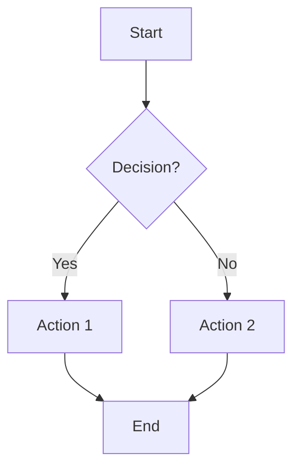
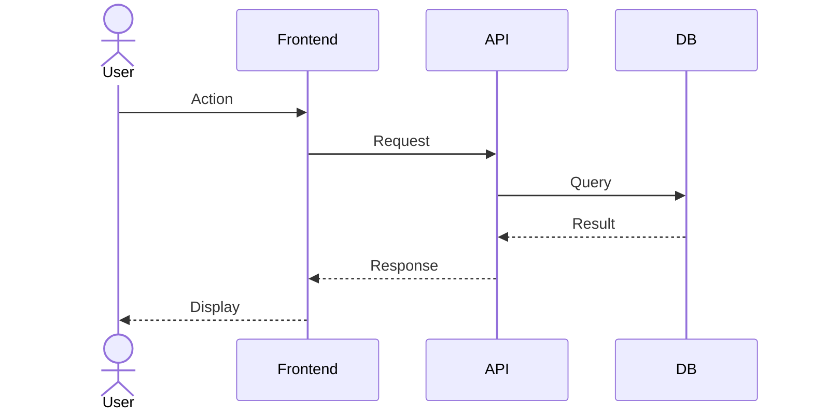
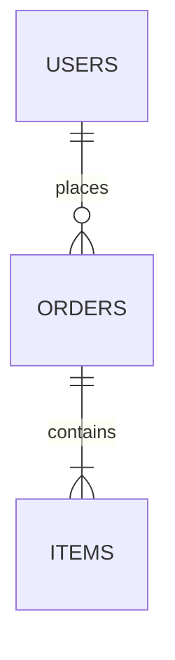
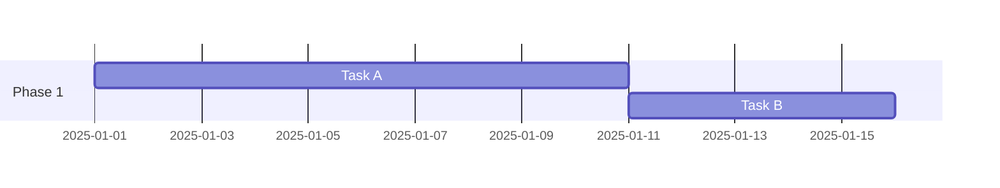
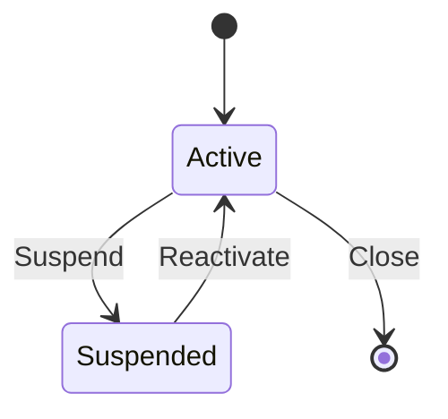

# Visual Architecture Skill

## Official Documentation (ALWAYS check first)

### Diagramming (Code-as-Diagram)
- Mermaid.js: https://mermaid.js.org/intro/syntax-reference.html
- Mermaid Live Editor: https://mermaid.live/
- C4 Model: https://c4model.com/

### Data Visualization (Interactive Charts)
- Recharts: https://recharts.org/en-US/api
- D3.js: https://d3js.org/
- Chart.js: https://www.chartjs.org/docs/latest/
- Plotly.js: https://plotly.com/javascript/

### Presentations
- Marp: https://marp.app/
- reveal.js: https://revealjs.com/

### Design Principles
- Apple HIG Charts: https://developer.apple.com/design/human-interface-guidelines/charts
- Edward Tufte: Data-ink ratio, no chartjunk, no 3D

## Diagram Type Selection

| Need | Use | Format |
|------|-----|--------|
| System architecture | C4 Context / Flowchart | Mermaid `.mermaid` |
| API interactions | Sequence diagram | Mermaid `.mermaid` |
| Database schema | ERD | Mermaid `.mermaid` |
| Feature lifecycle | State diagram | Mermaid `.mermaid` |
| Project timeline | Gantt chart | Mermaid `.mermaid` |
| User journey | Journey / Flowchart | Mermaid `.mermaid` |
| Branch strategy | Git graph | Mermaid `.mermaid` |
| Brainstorming | Mindmap | Mermaid `.mermaid` |
| Metrics over time | Line / Area chart | Recharts `.jsx` |
| Category comparison | Bar chart | Recharts `.jsx` |
| Composition | Donut (5 or fewer) / Treemap (>5) | Recharts `.jsx` |
| Correlation | Scatter plot | Recharts `.jsx` |
| Live dashboard | KPI cards + charts | React `.jsx` |
| Stakeholder deck | Slides | Marp `.md` / PPTX |

## Chart Design Rules (Apple + Tufte)

1. **Data-ink ratio** — Remove everything that doesn't encode data
2. **No 3D** — Ever. Distorts perception.
3. **No pie chart > 5 segments** — Use bar chart instead
4. **Label directly** — On the data, not in a separate legend
5. **Axes start at zero** — For bar charts always
6. **Color = meaning** — Blue primary, red error, green success, gray neutral
7. **Responsive** — `<ResponsiveContainer>` wrapping all Recharts
8. **Accessible** — Color-blind safe palette + patterns/labels

## Color Palette (consistent across all charts)
```
Primary:    #2563EB (blue)
Secondary:  #7C3AED (purple)
Tertiary:   #059669 (green)
Warning:    #D97706 (amber)
Error:      #DC2626 (red)
Neutral:    #6B7280 (gray)
```

## Mermaid Quick Reference

### Flowchart


### Sequence


### ERD


### Gantt


### State


## Dashboard Layout Pattern
```
+----------+ +----------+ +----------+ +----------+  <- KPI cards (4 max)
| Metric1  | | Metric2  | | Metric3  | | Metric4  |
+----------+ +----------+ +----------+ +----------+
+---------------------------------------------------+  <- Primary chart (full width)
|           Main Trend Chart                        |
+---------------------------------------------------+
+---------------------+ +-------------------------+  <- Secondary charts (2-col)
|  Breakdown Chart    | |  Distribution Chart     |
+---------------------+ +-------------------------+
+---------------------------------------------------+  <- Detail table
|           Data Table                              |
+---------------------------------------------------+
```

## Presentation Rules (Apple Keynote Style)
1. One idea per slide — max 20 words
2. Full-bleed visuals — charts and images fill the slide
3. Dark backgrounds for data slides
4. Title: 44pt, Body: 28pt, Labels: 18pt
5. Build reveals — show data progressively
6. Structure: Problem -> Solution -> Demo -> Architecture -> Metrics -> Roadmap -> Ask

## Quality Checklist
- [ ] Main message understood in 3 seconds
- [ ] Title + axis labels + units on every chart
- [ ] Color-blind accessible
- [ ] Responsive (mobile + desktop)
- [ ] No chartjunk (3D, gradients, decorative elements)
- [ ] Loading + empty states for async data
- [ ] Consistent with project design system
